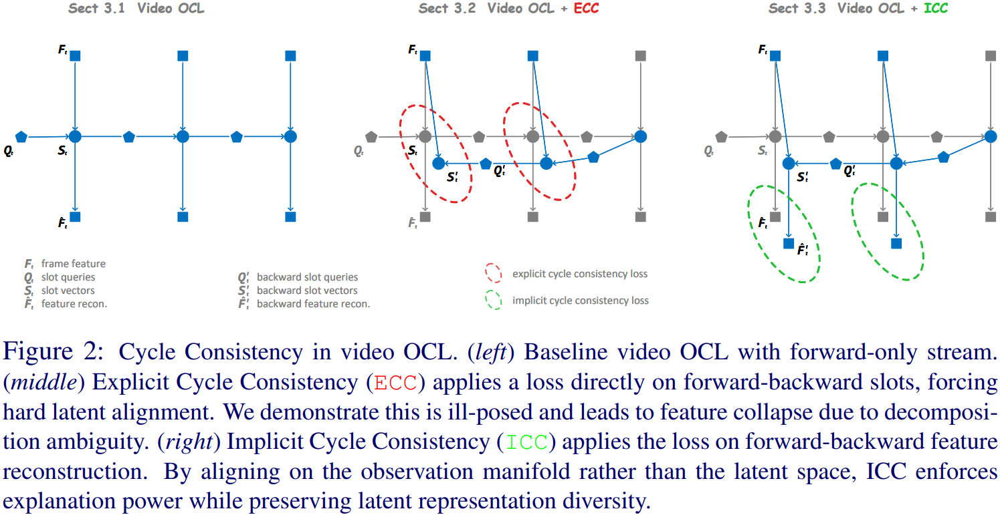
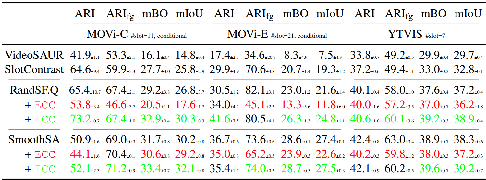
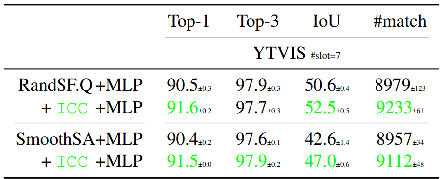

# `ICC` Cycle Consistency in Video Object-Centric Learning


[](https://arxiv.org/abs/2605.30211)<!-- [](https://www.python.org) -->
[](LICENSE)
[](https://github.com/Genera1Z/ICC#-model-checkpoints--training-logs)
[](https://github.com/Genera1Z/ICC#-model-checkpoints--training-logs)


> Self-supervised video Object-Centric Learning (OCL) aims to discover distinct objects and associate them across time, whereas self-supervised Multi-Object Tracking (MOT) focuses on associating pre-defined object detections or segmentations.
Although well-established in MOT, Cycle Consistency (CC) cannot naively or explicitly apply to the latent slot space of OCL.
Unlike the deterministic and ideal object representations in MOT, OCL slots are inherently stochastic and ambiguous due to non-unique scene decompositions. Enforcing explicit cycle consistency (ECC) on slots imposes rigid mean seeking. This severely penalizes the model for exploring alternative but equally valid decompositions, thereby driving towards feature collapse.
To resolve this dilemma, we propose \textit{Implicit Cycle Consistency (ICC)}, which shifts the cycle-consistency constraint from the restrictive slot space to the continuous reconstruction manifold, encouraging slots to reach a soft consensus on collectively interpreting the visual scene rather than forcing rigid point-to-point feature alignment.
Extensive experiments on complex video OCL benchmarks demonstrate that ICC avoids feature collapse and outperforms ECC baselines.


<!-- ## 🎉 Accepted to BMVC 2026 as a Poster -->

Official source code, model checkpoints and training logs for paper "**Cycle Consistency in Video Object-Centric Learning**".

**Our model achitecture**:



## 🏆 Performance

**Object discovery accuracy**: (Input resolution is **256×256** (224×224); **DINO2 ViT-S/14** is used for encoding)



**Object recognition accuracy**:




## 🌟 Highlights

⭐⭐⭐ ***Please check GitHub repo [VQ-VFM-OCL](https://github.com/Genera1Z/VQ-VFM-OCL).*** ⭐⭐⭐


## 🧭 Repo Stucture

[Source code](https://github.com/Genera1Z/ICC).
```shell
- config-randsfq/       # *** configs for RandSF.Q + ICC ***
- config-smoothsa/      # *** configs for SmoothSA + ICC ***
- object_centric_bench/
  - datum/              # dataset loading and preprocessing
  - model/              # model building
    - ...
    - randsfq.py        # for baseline RandSF.Q model building
    - rsfq3.py          # *** our RandSF.Q + ICC ***
    - smoothsa.py       # for baseline SmoothSA model building ***
    - ssav3.py          # *** our SmoothSA + ICC ***
    - ...
  - learn/              # metrics, optimizers and callbacks
- train.py
- eval.py
- requirements.txt
```

[Releases](https://github.com/Genera1Z/ICC/releases).
```shell
- archive-randsfq/      # *** our RandSF.Q + ICC models and logs ***
- archive-smoothsa/     # *** our SmoothSA + ICC models and logs ***
```


## 🚀 Converted Datasets

Datasets MOVi-C, MOVi-E and YTVIS-HQ are converted into LMDB format and can be used off-the-shelf.
For details, please check [RandSF.Q](https://github.com/Genera1Z/RandSF.Q#-converted-datasets) or [SmoothSA](https://github.com/Genera1Z/SmoothSA#-converted-datasets)


## 🧠 Model Checkpoints & Training Logs

**The model checkpoints and training logs (@ random seeds 42, 43 and 44) for all methods** are available as [releases](https://github.com/Genera1Z/ICC/releases). All backbones are unified as DINO2-S/14.
- [archive-rsfq3](https://github.com/Genera1Z/ICC/releases/tag/archive-rsfq3): Our `RandSF.Q + ICC` trained on datasets MOVi-C/E and YTVIS-HQ, both object discovery and object recognition.
- [archive-ssav3](https://github.com/Genera1Z/ICC/releases/tag/archive-ssav3): Our `SmoothSA + ICC` trained on datasets MOVi-C/E and YTVIS-HQ, both object discovery and object recognition.
- For other video OCL baselines, **VideoSAUR**, **SlotContrast**, **RandSF.Q** and **SmoothSA**, please check repo [RandSF.Q](https://github.com/Genera1Z/RandSF.Q#-model-checkpoints--training-logs) and [SmoothSA](https://github.com/Genera1Z/SmoothSA#-model-checkpoints--training-logs).


## 🔥 How to Use

Please check repo [RandSF.Q](https://github.com/Genera1Z/RandSF.Q#-how-to-use) or [SmoothSA](https://github.com/Genera1Z/SmoothSA#-how-to-use).


## 🤗 Contact & Support

If you have any issues on this repo or cool ideas on OCL, please do not hesitate to contact me!
- page: https://genera1z.github.io
- email: rongzhen.zhao@aalto.fi, zhaorongzhenagi@gmail.com

If you are applying OCL (not limited to this repo) to tasks like **visual question answering**, **visual prediction/reasoning**, **world modeling** and **reinforcement learning**, let us collaborate!


## ⚗️ Further Research

My further research works on OCL can be found in [my repos](https://github.com/Genera1Z?tab=repositories) or [my academic page](https://genera1z.github.io).


## 📚 Citation

If you find this repo useful, please cite our work.
```
@article{zhao2026icc,
  title={{Cycle Consistency in Video Object-Centric Learning}},
  author={Zhao, Rongzhen and Li, Zhiyuan and Wei, Ruonan and Kannala, Juho and Pajarinen, Joni},
  journal={arXiv:2605.30211},
  year={2026}
}
```
